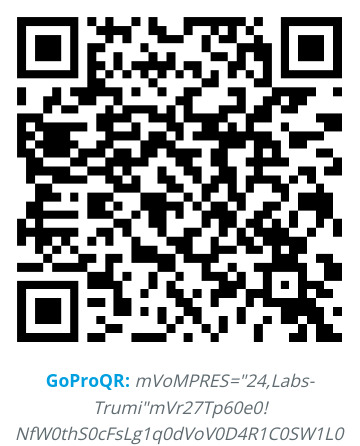

# TRumi: Trossen Robotics Universal Manipulation Interface

## Table of Contents

- [Installation](#installation)
- [Dataset Generation Pipeline](#dataset-generation-pipeline)
- [Data Collection](#data-collection)
- [Dataset Formats](#dataset-formats)
- [License](#license)
- [Acknowledgements](#acknowledgements)

## Installation

### Prerequisites

- Python 3.12
- [uv](https://docs.astral.sh/uv/) package manager
- [Docker](https://docs.docker.com/get-started/get-docker/) (required for ORB-SLAM3)
- [ExifTool](https://exiftool.org/) (`sudo apt install libimage-exiftool-perl` on Ubuntu)

### Install

Clone the repository and install the package:

```bash
cd ~
git clone https://github.com/TrossenRobotics/trumi.git
cd trumi
uv sync
```

This installs all dependencies declared in `pyproject.toml` into a local `.venv`.

To activate the environment manually:

```bash
source .venv/bin/activate
```

Or prefix any command with `uv run` to automatically use the environment without activating it.

### ORB-SLAM3 Docker Image

The SLAM pipeline runs ORB-SLAM3 inside a Docker container.
Build the image once before running the pipeline:

See [TrossenRobotics/ORB_SLAM3 — DOCKER.md](https://github.com/TrossenRobotics/ORB_SLAM3/blob/master/DOCKER.md)
for setup instructions.

### Developer Setup (optional)

Install pre-commit hooks:

```bash
uv run pre-commit install
```


## Dataset Generation Pipeline

An example dataset is available on [Hugging Face](https://huggingface.co/datasets/TrossenRoboticsCommunity/trumi-dataset) to try the pipeline without recording your own data.

Download it using the [Hugging Face CLI](https://huggingface.co/docs/huggingface_hub/guides/cli) (downloads into the current directory, preserving the `example_gopro13_dataset/` folder structure):

```bash
cd ~/trumi
hf download TrossenRoboticsCommunity/trumi-dataset \
    --repo-type dataset \
    --local-dir .
```

Before running `dataset_generation_pipeline.py`, ensure:

1. The Docker daemon is running:

```bash
docker info
```

2. Your session directory is organized with the appropriate videos:

```
<session_dir>/
└── raw_videos/
    ├── mapping.mp4               # rename your mapping video to this
    ├── gripper_calibration/      # place gripper calibration video(s) here
    │   └── *.mp4                 # one video per camera serial
    └── *.mp4                     # remaining videos are treated as demonstrations
```

Run the full pipeline with:

```bash
uv run python scripts/dataset_generation_pipeline.py <session_dir>
```

For example, using the downloaded example dataset:

```bash
uv run python scripts/dataset_generation_pipeline.py example_gopro13_dataset
```

Example output (truncated to final steps):

```
...
############### 06_generate_dataset_plan ###############
INFO: Found following cameras:
camera_serial
C3534250760071    2
INFO: Assigned camera_idx: right=0; left=1; non_gripper=2,3...
             camera_serial  gripper_hw_idx                                                  example_vid
camera_idx
0           C3534250760071               0  demo_C3534250760071_2026.03.31_20.59.03.643175_GX010168.MP4
INFO: 99% of raw data are used.
INFO: Dropped demos: 0
INFO: Saved dataset plan (2 episodes) to example_gopro13_dataset/dataset_plan.pkl
INFO:
############### 07_generate_replay_buffer ###############
INFO: 2 videos used in total!
100%|█████████████████████████████████████████████████████████████████████████████| 2/2 [00:19<00:00,  9.98s/it]
INFO: Saving ReplayBuffer to example_gopro13_dataset/dataset.zarr.zip
INFO: Done! 2 videos used in total!
```

For this dataset, 99% of the data are useable (successful SLAM), with 0 demonstrations dropped. If your dataset has a low SLAM success rate, double check if you carefully followed our [data collection instructions](#data-collection).

**Notes:**

- SLAM processes frames at a lower rate than the recorded video to ensure enough IMU samples
  accumulate between consecutive SLAM frames (minimum 3 samples/frame at 200 Hz IMU rate). For a
  120 fps recording this means SLAM runs at 60 fps (skip=2). Check the `skip` value for your
  recording from the log file produced during the mapping SLAM step
  (`<session_dir>/demos/mapping_*/slam_stdout_mapping.txt`):
  ```
  Video: 119.88 fps  |  SLAM: 59.9401 fps (skip=2)  |  IMU/frame: 3.33667
  ```
  Pass the `skip` value as `--slam_frame_stride` to `dataset_generation_pipeline.py` (and to
  `04_detect_aruco.py`, `06_generate_dataset_plan.py`, `07_generate_mcap_dataset.py`, and
  `07_generate_zarr_dataset.py` when running steps manually). The default is `2` (120 fps → 60 fps SLAM).

- To inspect intermediate results, visualization scripts are provided:

  - **SLAM trajectory** — plots the ORB-SLAM3 camera trajectory from a session's
    `camera_trajectory.csv` as a 3D path (purple = start, yellow = end):
    ```bash
    uv run python scripts/visualize_trajectory.py -t <demo_dir>/camera_trajectory.csv
    ```

  - **ArUco tag detections** — renders tag detections overlaid on the source video and writes an
    annotated MP4:
    ```bash
    uv run python scripts/visualize_aruco_video.py \
        -i <demo_dir> \
        -ci <path/to/intrinsics.json> \
        -sfs <slam_frame_stride> \
        -o <output.mp4>
    ```


## Data Collection

A dataset consists of one or more sessions. Sessions serve as distinct units of data collection, all originating from the same location. Each session includes three key components:

- A SLAM mapping video
- A gripper calibration video
- A series of task demonstration videos

### Step 0: GoPro Preparation

Install [GoPro Labs firmware](https://gopro.github.io/labs/). GoPro Labs allows setting any camera setting by scanning a QR code.

Scan the following QR code with your GoPro to apply all required camera settings:



Once the settings are saved, the GoPro screen will show **"Labs-Trumi"** with the applied configuration:


**Note:** When using with ultra-wide lens, disable auto lens detection and manually set the lens to standard (Preferences > Lens Mod > Standard). This prevents GoPro from applying additional distortion correction, ensuring raw undistorted frames are saved.

### Step 1: Timecode Sync

**Note:** This step is only required for bi-manual (two-gripper) data collection. Skip it if you are using a single gripper.

Serve the timecode sync page locally and open the printed URL in a browser, then scan the refreshing QR code using your GoPro (requires Labs firmware). Precise synchronization between the two grippers is critical for bi-manual data collection.

```bash
uv run python scripts/serve_timecode_sync.py
```

**Tip:** Adjust your distance to the QR code if you have difficulty scanning.

### Step 2: Mapping Video

<!-- TODO: add photo/video of mapping video -->

The mapping video is used by ORB-SLAM3 to build a 3D map of the environment. SLAM success rate is highly sensitive to the scene and the mapping process.

**Scene selection tips:**

- Prefer environments with enough visual texture
- Avoid large plain surfaces (white walls, bare ceilings, empty corners)

We provide printed mapping markers — place the marker on the table and follow the mapping process carefully. Correct placement is critical for SLAM success rate.

To print your own markers, use the files in [`assets/aruco_markers/`](assets/aruco_markers/). The physical printed size must match exactly — incorrect sizes will produce inaccurate poses and gripper widths:

| Marker | Dictionary | ID | Size |
|---|---|---|---|
| Mapping | DICT_4X4_50 | 13 | 0.16 m |
| Gripper 0 left | DICT_4X4_50 | 0 | 0.016 m |
| Gripper 0 right | DICT_4X4_50 | 1 | 0.016 m |
| Gripper 1 left | DICT_4X4_50 | 6 | 0.016 m |
| Gripper 1 right | DICT_4X4_50 | 7 | 0.016 m |

### Step 3: Gripper Calibration Video

<!-- TODO: add photo/video of gripper calibration -->

Record a short video of opening and closing the gripper 5 times. This is used to calibrate the gripper finger tag detection.

### Step 4: Demonstrations

<!-- TODO: add photo/video of demonstration collection -->

Record *N* demonstration videos. The number of demonstrations needed depends on task complexity and environment variability. We recommend 200 demonstrations for a single task in a fixed environment.


## Dataset Formats

The pipeline supports two output formats, selectable via `--format` (`-f`):

```bash
# MCAP (default)
uv run python scripts/dataset_generation_pipeline.py <session_dir>

# Zarr
uv run python scripts/dataset_generation_pipeline.py -f zarr <session_dir>
```

**MCAP** — One `.mcap` file per episode in a directory (`dataset_mcap/`). Each file contains time-aligned robot state and JPEG-compressed camera images as typed, self-describing messages. MCAP files can be inspected with [Foxglove Studio](https://foxglove.dev/).

**Zarr** — A single `dataset.zarr.zip` archive containing all episodes in a flat NumPy-backed replay buffer with JpegXl-compressed images.

Both formats store identical data: per-step end-effector pose (position + axis-angle rotation), gripper width, demo start/end poses, and camera images.


## License

This repository is released under the MIT license. See [LICENSE](LICENSE) for additional details.

## Acknowledgements

* This work is built upon [Chi Cheng](https://github.com/cheng-chi) et al.'s [Universal Manipulation Interface (UMI)](https://github.com/real-stanford/universal_manipulation_interface). We directly follow and extend their implementation for the Trossen Robotics platform.
* Our GoPro SLAM pipeline is adapted from [Steffen Urban](https://github.com/urbste)'s [fork](https://github.com/urbste/ORB_SLAM3) of [ORB\_SLAM3](https://github.com/UZ-SLAMLab/ORB_SLAM3).
* We used [Steffen Urban](https://github.com/urbste)'s [OpenImuCameraCalibrator](https://github.com/urbste/OpenImuCameraCalibrator/) for camera and IMU calibration.
* The UMI gripper's core mechanism is adapted from [Push/Pull Gripper](https://www.thingiverse.com/thing:2204113) by [John Mulac](https://www.thingiverse.com/3dprintingworld/designs).
* UMI's soft finger is adapted from [Alex Alspach](http://alexalspach.com/)'s original design at TRI.
