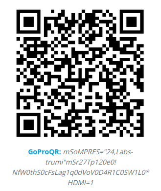
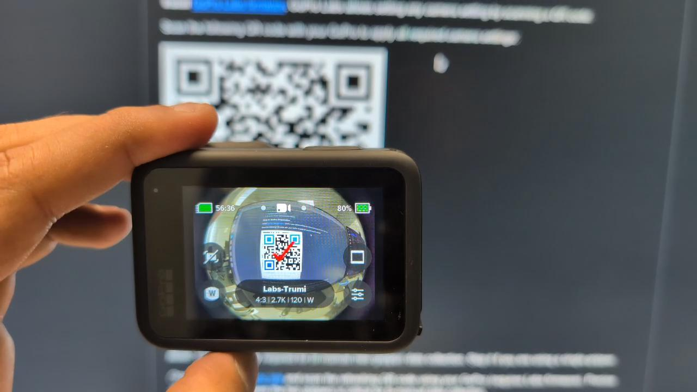

===================
GoPro Configuration
===================

The TRumi pipeline expects the GoPro to be configured with a specific set of camera settings.
This page walks through installing the required firmware, applying the settings, and (for bimanual collection) synchronizing timecode across two cameras.

Install GoPro Labs Firmware
===========================

TRumi uses `GoPro Labs firmware <https://gopro.github.io/labs/>`_, which lets you apply any camera setting by scanning a QR code.

Install GoPro Labs on each camera by following the official `GoPro Labs installation instructions <https://gopro.github.io/labs/install/>`_, which walk through the firmware download and step-by-step setup.

Apply the Camera Settings
=========================

Scan the following QR code with your GoPro to apply all required TRumi camera settings:

Once the settings are saved, the GoPro screen shows **"Labs-Trumi"** with the applied configuration:

|

.. note::

    When using the Ultra Wide Lens Mod, disable automatic lens detection and manually set the lens to **Standard** (*Preferences → Lens Mod → Standard*).
    This prevents the GoPro from applying additional distortion correction, ensuring raw undistorted frames are saved for the pipeline.

What the QR Code Configures
===========================

The QR code applies a complete GoPro Labs preset named **Labs-Trumi**.
The settings below determine the format of every video you record, so it is worth knowing them up front — your downstream pipeline needs to expect the same resolution, aspect ratio, frame rate, and lens.

.. list-table::
    :align: center
    :header-rows: 1
    :class: centered-table

    * - Setting
      - Value
    * - Video mode
      - Standard
    * - Resolution
      - 2.7K (2704 × 2028)
    * - Aspect ratio
      - 4:3
    * - Frame rate
      - 120 fps
    * - Lens (field of view)
      - Wide (with the Ultra Wide Lens Mod)
    * - Stabilization (HyperSmooth)
      - Off
    * - Color profile
      - Flat (Protune enabled)

Recording at **2.7K 4:3, 120 fps** with the **Wide** lens and **stabilization turned off** gives the SLAM pipeline a wide field of view over a fixed, calibrated fisheye geometry — electronic stabilization is disabled so it cannot crop or warp the frames between shots.
The **flat** color profile preserves detail across highlights and shadows.

.. note::

    The preset also applies a number of lower-level Protune and camera options (white balance, ISO limits, sharpness, audio, HDMI, etc.).
    These are tuned for the pipeline and can generally be left as applied.

Timecode Sync (Bimanual Only)
=============================

.. note::

    This step is required only for bimanual (two-gripper) data collection.
    Skip it if you are using a single gripper.

Precise synchronization between the two grippers is critical for bimanual data collection.
Serve the timecode sync page locally, open the printed URL in a browser, and scan the refreshing QR code with each GoPro (requires Labs firmware):

.. code-block:: bash

    uv run python scripts/serve_timecode_sync.py

.. tip::

    Adjust your distance to the QR code if you have trouble scanning it.

With the GoPro configured, continue to :doc:`/software_setup` to install the dataset generation pipeline.
