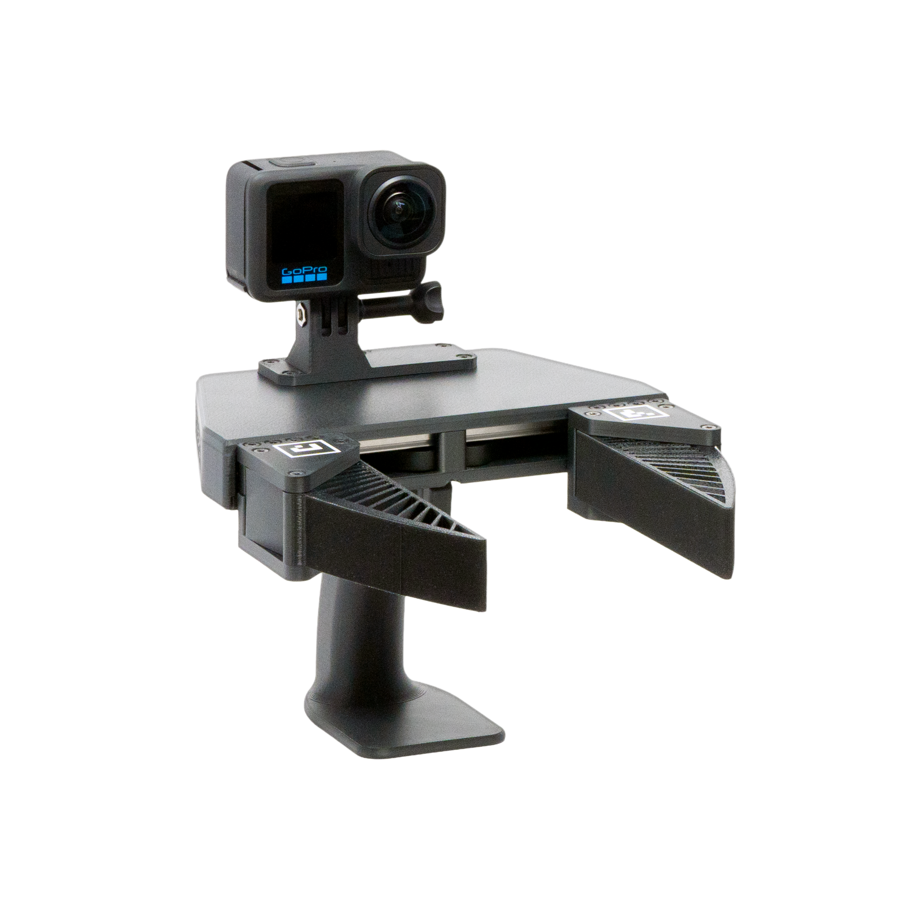
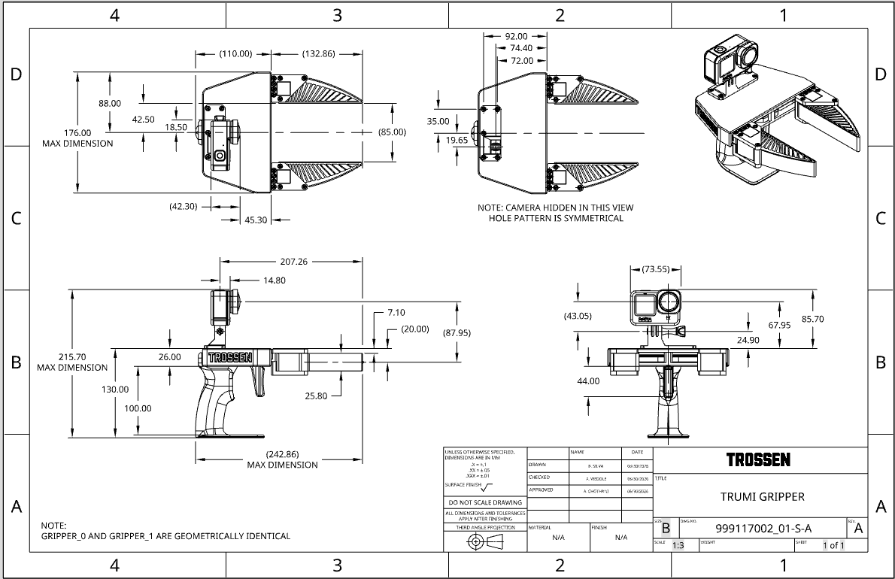

==============
Specifications
==============

This page lists the TRumi reference drawings and hardware specifications.

Reference Drawings
==================

    TRumi (solo), front view.

    Dimensioned customer drawing (all dimensions in mm).
    Gripper 0 and Gripper 1 are geometrically identical.

Hardware Specifications
=======================

.. list-table::
    :align: center
    :header-rows: 1
    :class: centered-table

    * - Item
      - Specification
    * - Camera
      - GoPro HERO13 Black (supported configuration)
    * - Lens mod
      - GoPro Ultra Wide Lens Mod
    * - Field of view
      - 177°
    * - Trigger pull force
      - 0.4 lb
    * - Finger identifiers
      - Embedded multicolor identifiers, built into the finger mounts (see :ref:`aruco-markers`)
    * - Overall dimensions (max)
      - 242.9 × 215.7 × 176.0 mm (see drawing)
    * - Mass
      - ~800 g
    * - Configurations
      - Single gripper or bimanual (two grippers)
    * - Output data formats
      - Zarr, MCAP

.. note::

    The GoPro HERO13 Black with the Ultra Wide Lens Mod is the supported camera configuration.
    The pipeline's camera intrinsics and tag detection are tuned for this setup.
